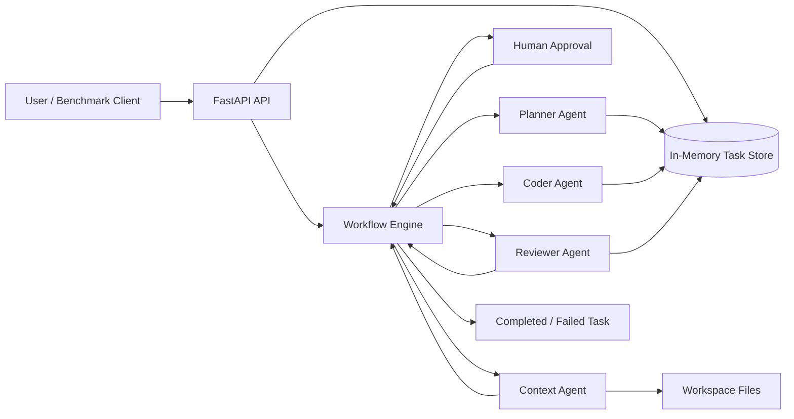

# Multi-Agent AI Coding Assistant

[中文版本](./README.md)


> A FastAPI-based multi-agent backend for AI-assisted software delivery, covering task planning, human approval, code context analysis, code generation, review loops, and benchmark-driven evaluation.

## Project Overview

This project implements a lightweight multi-agent coding workflow powered by four specialized agents:

- `Planner`: turns a natural-language requirement into a structured execution plan
- `Context`: reads real local files and analyzes dependencies
- `Coder`: generates structured code drafts from plan and context
- `Reviewer`: performs strict code review and drives iterative repair loops

The service exposes HTTP APIs for task creation, approval, and status tracking, and includes a `benchmark.py` script for end-to-end evaluation against a running server.

## Key Features

- Human-in-the-loop approval between planning and execution
- Secure local workspace file reading for code context analysis
- Structured LLM outputs validated by Pydantic models
- Bounded review-retry workflow for failed code reviews
- Async benchmark script for full pipeline evaluation

## Architecture



## Current Runtime Characteristics

- Task state is stored in memory only
- Generated code is returned in task results and is not automatically written to disk
- The current version should run with a single worker
- Best suited for local development, demos, and architecture validation

## Project Structure

```text
ai_coding_assistant/
├── app/
│   ├── api/               # HTTP routing layer
│   ├── agents/            # Planner / Context / Coder / Reviewer
│   ├── core/              # Configuration and LLM client
│   ├── models/            # Pydantic data models
│   ├── services/          # Workflow orchestration
│   └── main.py            # FastAPI entrypoint
├── workspace/             # Code workspace read by AI
├── benchmark.py           # Benchmark script
├── requirements.txt
├── .env.example
├── README.md
└── README.en.md
```

## API Overview

### Health Check

```http
GET /
```

Example response:

```json
{
  "status": "ok",
  "message": "AI Coding Assistant API is running"
}
```

### Create Task

```http
POST /api/v1/tasks/
Content-Type: application/json
```

Request body:

```json
{
  "requirement": "Add a GET API for product search with price-range and stock-status filters"
}
```

### Get Task Status

```http
GET /api/v1/tasks/{task_id}
```

### Approve Task

```http
POST /api/v1/tasks/{task_id}/approve
Content-Type: application/json
```

Request body:

```json
{
  "is_approved": true,
  "feedback": "Optional feedback when rejecting a plan"
}
```

## Environment Requirements

- Python 3.10+
- Conda or venv
- An available OpenAI-compatible model service
- An API key with access to the configured model

## Configuration

The project reads runtime configuration from `.env`. Start by copying the template:

```bash
cp .env.example .env
```

Key configuration fields:

```env
OPENAI_API_KEY=
OPENAI_BASE_URL=https://dashscope.aliyuncs.com/compatible-mode/v1
OPENAI_MODEL=glm-5
APP_NAME=ai_coding_assistant
APP_ENV=development
LOG_LEVEL=INFO
WORKSPACE_DIR=workspace
```

Notes:

- `OPENAI_API_KEY`: required
- `OPENAI_BASE_URL`: OpenAI-compatible endpoint
- `OPENAI_MODEL`: must match the provider behind the endpoint
- `WORKSPACE_DIR`: local directory read by the Context agent

If you see `403 access_denied`, check the following first:

1. `OPENAI_BASE_URL` and `OPENAI_MODEL` belong to the same provider
2. The API key has access to the target model
3. The service has been restarted after editing `.env`

## Local Development Setup

### 1. Create and activate the environment

If you use Conda:

```bash
cd /home/wxr/proj/ai_coding_assistant
eval "$(conda shell.bash hook)"
conda create -n ai_coding python=3.10 -y
conda activate ai_coding
```

### 2. Install dependencies

```bash
pip install -r requirements.txt
```

### 3. Prepare configuration

```bash
cp .env.example .env
```

Then edit `.env` and fill in your own model service settings.

### 4. Start the service

```bash
python -m uvicorn app.main:app --host 127.0.0.1 --port 8000 --reload
```

After startup, verify the health endpoint:

```bash
curl http://127.0.0.1:8000/
```

## Quick Usage Examples

### Create a task

```bash
curl -X POST http://127.0.0.1:8000/api/v1/tasks/ \
  -H "Content-Type: application/json" \
  -d '{"requirement":"Write a Python script that reads a JSON file and prints the line count"}'
```

### Query a task

```bash
curl http://127.0.0.1:8000/api/v1/tasks/<task_id>
```

### Approve a task

```bash
curl -X POST http://127.0.0.1:8000/api/v1/tasks/<task_id>/approve \
  -H "Content-Type: application/json" \
  -d '{"is_approved": true}'
```

## Benchmark Usage

Make sure the service is already running, then execute the benchmark in another terminal:

```bash
cd /home/wxr/proj/ai_coding_assistant
eval "$(conda shell.bash hook)"
conda activate ai_coding
python benchmark.py
```

The script will:

- submit benchmark tasks
- poll until each task enters the approval phase
- auto-approve the task
- poll until the task is completed or failed
- print completion rate, median duration, and average reviewer findings

You can customize the following fields in [benchmark.py](./benchmark.py):

- `TASK_PROMPTS`
- `TOTAL_ROUNDS`
- `PLANNING_TIMEOUT_SECONDS`
- `FINAL_TIMEOUT_SECONDS`

## Deployment Guide

### Single-machine deployment

The current version is designed for single-machine, single-process deployment because:

- task state is stored in process memory
- background workflows are launched with `asyncio.create_task(...)`
- multiple workers would not share the same `fake_db`

For that reason, run it with a single worker:

```bash
python -m uvicorn app.main:app --host 0.0.0.0 --port 8000
```

### Deploy with systemd

You can create `/etc/systemd/system/ai-coding-assistant.service` on a Linux server:

```ini
[Unit]
Description=AI Coding Assistant API
After=network.target

[Service]
Type=simple
User=your_user
WorkingDirectory=/path/to/ai_coding_assistant
Environment="PYTHONUNBUFFERED=1"
ExecStart=/path/to/miniconda3/envs/ai_coding/bin/python -m uvicorn app.main:app --host 0.0.0.0 --port 8000
Restart=always
RestartSec=5

[Install]
WantedBy=multi-user.target
```

Then run:

```bash
sudo systemctl daemon-reload
sudo systemctl enable ai-coding-assistant
sudo systemctl start ai-coding-assistant
sudo systemctl status ai-coding-assistant
```

### Production considerations

If you plan to evolve this into a production-grade service, prioritize the following:

- replace `fake_db` with persistent task storage
- move background workflows to a job queue or message queue
- add per-agent timeout and cancellation control
- write generated code back into `WORKSPACE_DIR`
- add authentication, audit logging, rate limiting, and monitoring

## Current Limitations

- Task state is not persisted
- Historical tasks are lost after a service restart
- Generated output is only stored in the API task payload
- The Context agent reads files but does not commit code changes
- End-to-end latency is directly impacted by model response time

## Future Directions

- integrate a database for tasks and approval records
- use object storage for intermediate artifacts
- add automatic code materialization and Git commit support
- improve observability across agent execution
- support multi-tenant scenarios and access control
