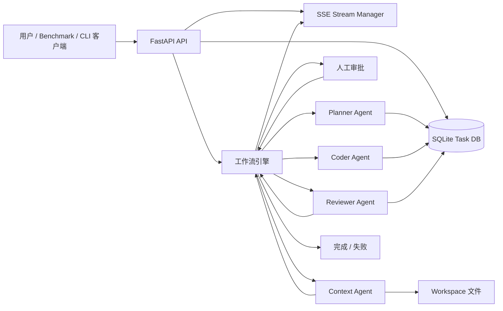

# Multi-Agent AI Coding 助手

[English Version](./README.en.md)


> 一个基于 FastAPI 的多智能体 AI 编码系统，提供后端工作流引擎与终端交互式 CLI，覆盖任务规划、人工审批、代码上下文分析、代码生成、审查循环与基准评估。

## 项目简介

本项目实现了一套轻量级多智能体编码工作流，由四个专职 Agent 协同完成：

- `Planner`：将自然语言需求拆解为结构化执行计划
- `Context`：读取本地真实文件并分析依赖关系
- `Coder`：结合计划与上下文生成结构化代码草稿
- `Reviewer`：执行严格代码审查并驱动迭代修复

服务通过 HTTP API 提供任务创建、审批、状态追踪与 SSE 实时流能力；同时提供 `cli.py` 作为 Typer + Rich 交互式客户端，并附带 `benchmark.py` 用于端到端评估。

## 核心特性

- 规划阶段与执行阶段之间支持人工审批
- 支持从本地工作区安全读取真实文件上下文
- 大模型输出通过 Pydantic 结构化校验
- 审查失败后可进入有限次重试循环
- 支持 `SSE` 事件流，实时输出模型 token 与任务状态
- 提供现代化 CLI 客户端（Typer + Rich），支持人类审批回环
- 提供异步 benchmark 脚本评估完整链路表现

## 架构图



## 当前运行特征

- 任务状态会持久化到本地 SQLite 数据库 `db/ai_coding.db`
- 生成代码会保存在任务结果中，并在审查通过后写入 `workspace`
- 支持通过 `/api/v1/tasks/{task_id}/stream` 订阅实时事件
- 服务重启后可继续查询历史任务，但不会恢复重启前仍在运行中的后台任务
- 当前版本应以单 worker 方式运行
- 适合本地开发、演示和架构验证场景

## 项目结构

```text
ai_coding_assistant/
├── app/
│   ├── api/               # HTTP 路由层
│   ├── agents/            # Planner / Context / Coder / Reviewer
│   ├── core/              # 配置与 LLM 客户端
│   ├── models/            # Pydantic 数据模型
│   ├── services/          # 工作流编排与 SSE 发布订阅
│   └── main.py            # FastAPI 入口
├── db/                    # SQLite 数据库目录（ai_coding.db）
├── workspace/             # 被 AI 读取的代码工作区
├── cli.py                 # 交互式 CLI 客户端（Typer + Rich）
├── benchmark.py           # 基准测试脚本
├── requirements.txt
├── .env.example
├── README.md
└── README.en.md
```

## API 概览

### 健康检查

```http
GET /
```

返回示例：

```json
{
  "status": "ok",
  "message": "AI Coding Assistant API is running"
}
```

### 创建任务

```http
POST /api/v1/tasks/
Content-Type: application/json
```

请求体：

```json
{
  "requirement": "新增一个商品查询的 GET 接口，支持按价格区间和库存状态过滤"
}
```

### 查询任务状态

```http
GET /api/v1/tasks/{task_id}
```

### 订阅任务实时事件（SSE）

```http
GET /api/v1/tasks/{task_id}/stream
Accept: text/event-stream
```

### 审批任务

```http
POST /api/v1/tasks/{task_id}/approve
Content-Type: application/json
```

请求体：

```json
{
  "is_approved": true,
  "feedback": "可选，审批驳回时可填写意见"
}
```

## 环境要求

- Python 3.10+
- Conda 或 venv
- 可用的 OpenAI 兼容模型服务
- 拥有对应模型访问权限的 API Key

## 配置说明

项目通过 `.env` 文件读取运行配置。可以先从模板复制：

```bash
cp .env.example .env
```

关键配置如下：

```env
OPENAI_API_KEY=
OPENAI_BASE_URL=https://dashscope.aliyuncs.com/compatible-mode/v1
OPENAI_MODEL=glm-5
APP_NAME=ai_coding_assistant
APP_ENV=development
LOG_LEVEL=INFO
WORKSPACE_DIR=workspace
```

说明：

- `OPENAI_API_KEY`：必填
- `OPENAI_BASE_URL`：OpenAI 兼容接口地址
- `OPENAI_MODEL`：必须和上面的服务提供方匹配
- `WORKSPACE_DIR`：Context Agent 读取本地代码的目录

如果出现 `403 access_denied`，优先检查：

1. `OPENAI_BASE_URL` 与 `OPENAI_MODEL` 是否属于同一供应商
2. API Key 是否拥有该模型访问权限
3. 修改 `.env` 后是否已重启服务

## 本地开发启动

### 1. 创建并激活环境

如果你使用 Conda：

```bash
cd /home/wxr/proj/ai_coding_assistant
eval "$(conda shell.bash hook)"
conda create -n ai_coding python=3.10 -y
conda activate ai_coding
```

### 2. 安装依赖

```bash
pip install -r requirements.txt
```

### 3. 准备配置

```bash
cp .env.example .env
```

然后编辑 `.env`，填入你自己的模型服务配置。

### 4. 启动服务

```bash
python -m uvicorn app.main:app --host 127.0.0.1 --port 8000 --reload
```

启动成功后，可以先验证健康检查：

```bash
curl http://127.0.0.1:8000/
```

## 快速调用示例

### 创建任务

```bash
curl -X POST http://127.0.0.1:8000/api/v1/tasks/ \
  -H "Content-Type: application/json" \
  -d '{"requirement":"写一个 Python 脚本，读取 json 文件并输出行数"}'
```

### 查询任务

```bash
curl http://127.0.0.1:8000/api/v1/tasks/<task_id>
```

### 审批任务

```bash
curl -X POST http://127.0.0.1:8000/api/v1/tasks/<task_id>/approve \
  -H "Content-Type: application/json" \
  -d '{"is_approved": true}'
```

### 订阅任务事件流（SSE）

```bash
curl -N http://127.0.0.1:8000/api/v1/tasks/<task_id>/stream
```

## CLI 交互客户端

启动服务后，在另一个终端运行：

```bash
cd /home/wxr/proj/ai_coding_assistant
python cli.py
```

CLI 支持：

- Rich 欢迎界面与自然语言需求输入
- 规划结果渲染与人工审批回环
- 模型 token 与任务状态实时流式输出
- 任务终态（完成/失败）高亮展示

可选参数：

```bash
python cli.py --base-url http://127.0.0.1:8000 --planning-timeout 180 --final-timeout 480 --poll-interval 2
```

## Benchmark 使用方法

先确保服务已经运行，然后在另一个终端执行：

```bash
cd /home/wxr/proj/ai_coding_assistant
eval "$(conda shell.bash hook)"
conda activate ai_coding
python benchmark.py
```

脚本会：

- 提交测试任务
- 轮询等待进入审批状态
- 自动审批
- 轮询直到任务完成或失败
- 输出完成率、中位时长和 Reviewer 检出改进点平均数

你可以根据需要修改 [benchmark.py](./benchmark.py) 中的：

- `TASK_PROMPTS`
- `TOTAL_ROUNDS`
- `PLANNING_TIMEOUT_SECONDS`
- `FINAL_TIMEOUT_SECONDS`

## 部署指南

### 单机部署

当前版本适合单机、单进程部署。原因如下：

- 任务状态虽然会持久化到 SQLite，但后台工作流仍通过应用进程内的 `BackgroundTasks` 启动
- 多 worker 模式下，虽然数据库可共享，但后台运行中的任务调度与文件落盘仍更适合单 worker 控制

因此建议以单 worker 方式运行：

```bash
python -m uvicorn app.main:app --host 0.0.0.0 --port 8000
```

### 使用 systemd 部署

可以在 Linux 服务器上创建 `/etc/systemd/system/ai-coding-assistant.service`：

```ini
[Unit]
Description=AI Coding Assistant API
After=network.target

[Service]
Type=simple
User=your_user
WorkingDirectory=/path/to/ai_coding_assistant
Environment="PYTHONUNBUFFERED=1"
ExecStart=/path/to/miniconda3/envs/ai_coding/bin/python -m uvicorn app.main:app --host 0.0.0.0 --port 8000
Restart=always
RestartSec=5

[Install]
WantedBy=multi-user.target
```

然后执行：

```bash
sudo systemctl daemon-reload
sudo systemctl enable ai-coding-assistant
sudo systemctl start ai-coding-assistant
sudo systemctl status ai-coding-assistant
```

### 生产环境注意事项

如果你准备将其升级为正式生产服务，建议优先补齐以下能力：

- 引入更成熟的数据库迁移体系与任务审计能力
- 将后台工作流迁移到消息队列或任务队列系统
- 为 Agent 调用增加单步超时与取消机制
- 增加生成代码回滚与审计能力
- 增加鉴权、审计日志、限流和监控

## 当前限制

- 后台运行中的任务不会跨进程或跨重启恢复
- 生成结果仍会保存在 API 返回的 `code_draft`
- Context 只读取文件，不自动提交 Git 变更
- 大模型响应速度会直接影响整条链路耗时

## 后续演进方向

- 将 SQLite 平滑升级到 PostgreSQL 等生产级数据库
- 接入对象存储保存中间工件
- 增加代码自动落盘与 Git 提交能力
- 支持更细粒度的 Agent 可观测性
- 支持多租户与权限控制
